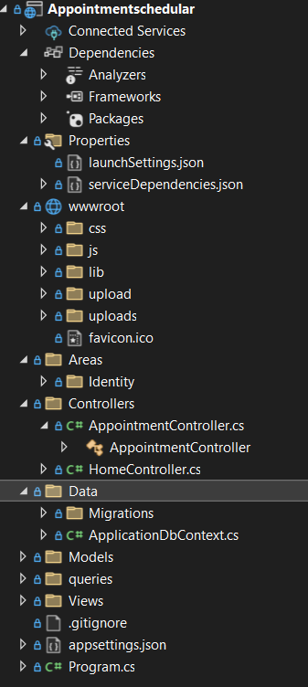
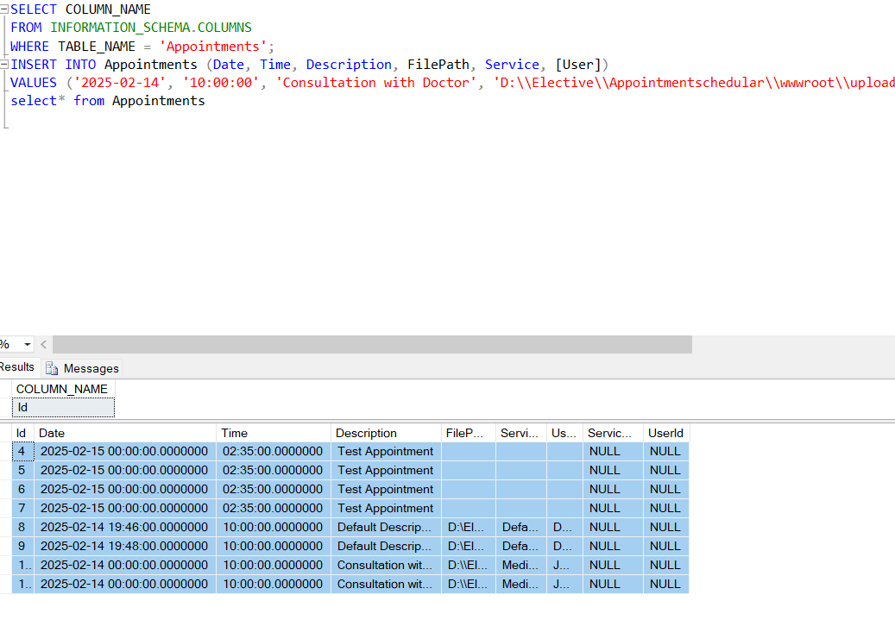
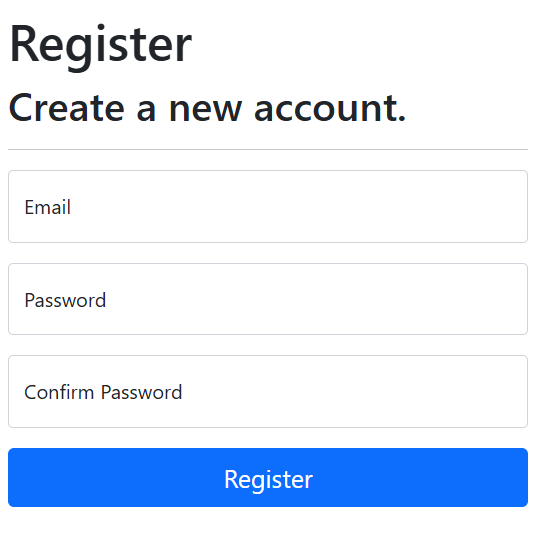
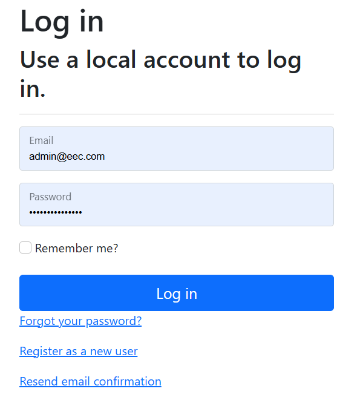
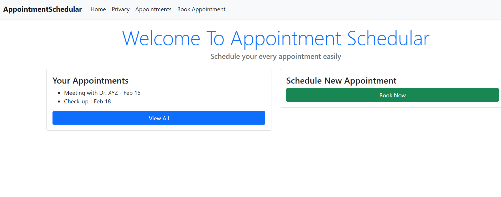
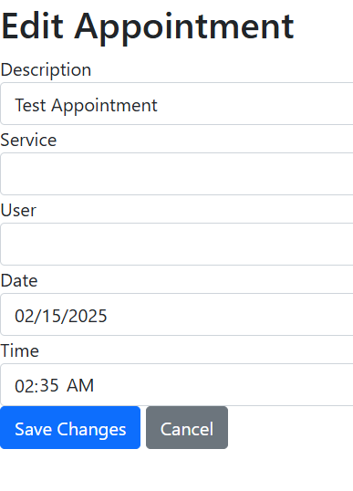
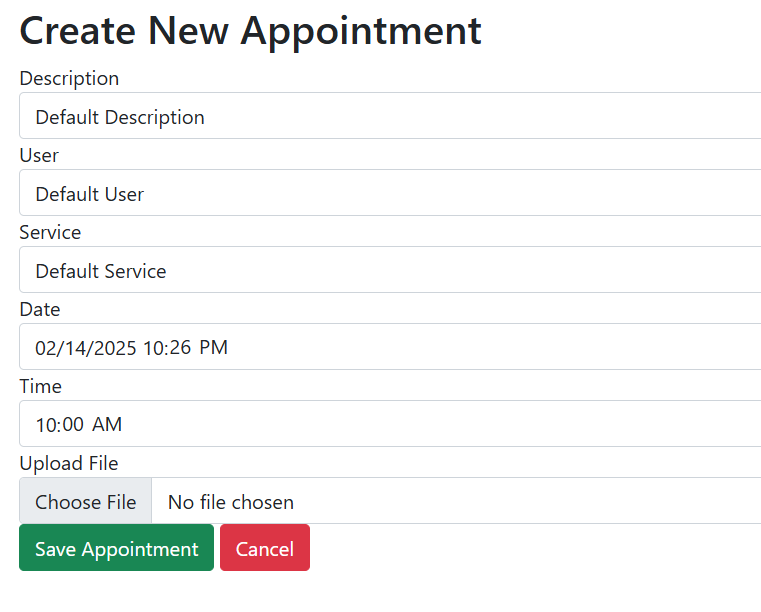
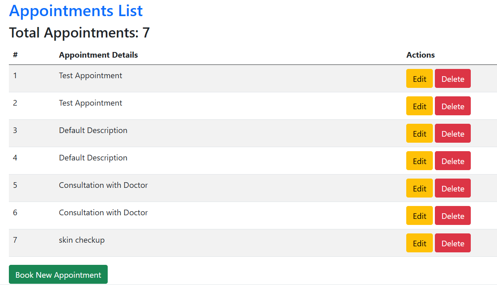
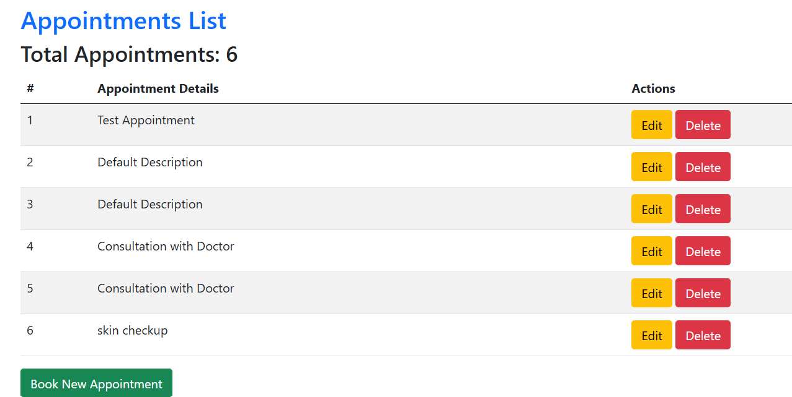

# Appointment Scheduling System
This is an Appointment Scheduling System built using .NET MVC. The system allows users to schedule appointments with various services and track upcoming appointments.

# Overview
This project is made on MVC framework which incorporates authentication and authorization features with ASP.net Core Identity. It lets user to schedule the appointment on the basis of service name, user name, description of appointment date and time. the crud operation is done ,can add,edit and delete the appointment.

# Features
### 1. Home Page
- Overview of the system functionalities.
- Quick access to user dashboard and login/signup options.

### 2. User Authentication
- Secure login and signup functionality.
- Role-based access for users and administrators.

### 3. Appointment creation
-create new appointments.
-Schedule the appointments.

### 4. Managing appointments
- Edit and delete appointments.

## Technologies Used:
- ASP.NET Core MVC
- Entity Framework
- SQL Server

# Basically:
- User registration and login
- Appointment creation and management
- View list of appointments
- File upload functionality for appointment documents

## Installation & Setup
1. Clone the repository.
2. Configure the database in `appsettings.json`.
3. Run migrations: `dotnet ef database update`.
4. Start the application using `dotnet run`.
   
# Related images

